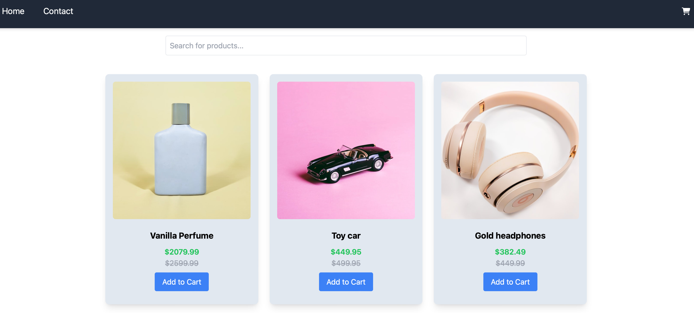

# **React E-Commerce Store**

This project is my Frontend Frameworks Course Assignment. It is a responsive e-commerce application built with React, featuring product exploration, cart functionality, and a checkout process.



## Features

- **Responsive Layout**: Consistent layout across all pages with a header, footer, and dynamic content rendering.
- **Product Listing & Details**: Browse through products, view detailed product pages with discount and review information.
- **Shopping Cart**: Add, remove, and clear products with real-time updates and persistent storage.
- **Contact Form**: Submit inquiries through a validated contact form.
- **Routing**: Seamless navigation using React Router.
- **JS Docs**: Comprehensive documentation is provided for each component via JSDoc comments.

## Technologies Used

- **React**: Front-end library for building interactive UIs.
- **React Router**: For client-side navigation.
- **Tailwind CSS**: Utility-first CSS framework for rapid UI development.
- **React Hook Form**: For handling form state and validations.
- **Yup**: Schema builder for form validation.
- **LocalStorage**: To persist the state of the shopping cart.

## Installation

1. Clone the repository:

```bash
git clone git@github.com:RamonaXR/projectExam-2.git
```

2.  Install the dependencies:

```bash
npm install
```

### Running

To run the app in development mode, use the following command:

```bash
npm run dev
```

To build the app for production, use the following command:

```bash
npm run build
```
